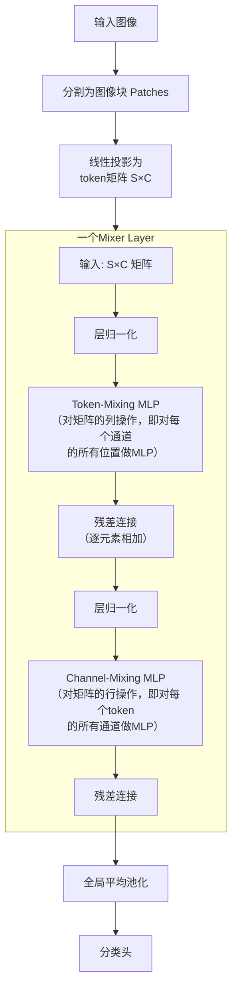

# MLPs

MLPs在进入正式的通过Mixer之前，会进行patch embedding操作，但是Mixer不适用positional encoding，因为token-mixing MLPs对输入tokens的顺序非常敏感,所以其先类似于vit向将每个patch压缩为向量，然后再通过一个可学习的线性层，将这个向量映射到更高维，将位置数据嵌入。

它处理图像的方式和ViT类似，先将图像分割成一系列小块（Patches），然后将每个小块转换成一个向量（Token），最终形成一个二维表格 `T x C`（T是token数量，代表空间位置；C是每个token的特征通道数）

token-mixing MLPs：允许信息在空间维度交互，独立作用于每一个channel，作用于列，融合不同token的特征

channel-mixing MLPs：允许信息在通道交互，独立作用于每一个token，作用于行，融合不同channel的特征

每一个MLP包含两个全连接层和一个非线性激活（GELU），一个Mixer layers的公式如下，计算复杂度和输入patches的数量成线性关系（ViT是平方关系）

​                                                                                                                                                                                                                                   

token-mixing MLPs共享参数，channel-mixing MLPs同样共享参数

可以这样理解：如果说ViT是将NLP的Transformer成功“复制”到视觉领域，那么MLP-Mixer就是将这个架构中的核心——注意力机制——彻底替换掉，只用最简单的多层感知机（MLP）来完成所有工作。

### 💡 核心创新点：极简主义的“混合”理念

MLP-Mixer的核心创新在于其极简而巧妙的设计：它抛弃了卷积和自注意力，仅通过两种MLP层的交替，来实现在不同维度上“混合”信息。

它处理图像的方式和ViT类似，先将图像分割成一系列小块（Patches），然后将每个小块转换成一个向量（Token），最终形成一个二维表格 `T x C`（T是token数量，代表空间位置；C是每个token的特征通道数）。其核心处理流程可以用下图表示：

这个过程的具体创新点在于：

1.  **双重MLP设计**：网络核心由交替堆叠的两种MLP层构成，分工明确。
    *   **Token-mixing MLP（token混合）**：作用于表格的**列**。它的作用是让**不同空间位置（即不同图像块）之间的信息进行交流**。对于某一特征通道，它混合了所有图像块在该通道上的值，从而捕捉全局的空间信息。
    *   **Channel-mixing MLP（通道混合）**：作用于表格的**行**。它的作用是让**同一个空间位置内，不同特征通道之间的信息进行交流**，类似于标准MLP或1x1卷积的功能。
    *   这种解耦设计，将空间维度和特征维度的信息融合完全分开处理，思路非常清晰。

2.  **抛弃位置嵌入（Position Embeddings）**：在ViT中，由于自注意力本身是“置换不变”的，必须依靠位置嵌入来告知模型图像块的位置信息。而在MLP-Mixer中，Token-mixing MLP本身就是对输入顺序**敏感**的，因为它会按照固定的顺序处理输入的图像块序列。因此，**Mixer完全不需要使用位置嵌入**，这进一步简化了架构。

### ⚔️ MLP-Mixer vs. Vision Transformer (ViT)

MLP-Mixer在设计哲学和实际表现上，与ViT有显著的不同。

| 对比维度           | MLP-Mixer                                                    | Vision Transformer (ViT)                                     |
| :----------------- | :----------------------------------------------------------- | :----------------------------------------------------------- |
| **核心操作**       | 纯MLP                                                        | 自注意力 (Self-Attention)                                    |
| **信息混合方式**   | 通过token-mixing和channel-mixing MLP，解耦地、**显式地**混合空间和通道信息 | 通过自注意力层**隐式地、全局地**学习所有图像块（token）之间的相互关系 |
| **计算复杂度**     | 与输入序列长度（图像块数）呈**线性关系** O(S)，效率更高      | 与输入序列长度呈**二次方关系** O(S²)，长序列下计算开销大     |
| **对数据的敏感度** | 更依赖于大规模数据集进行预训练，否则容易过拟合               | 同样需要大规模数据或强力的数据增强，但其归纳偏误更少         |
| **性能与效率**     | 在达到与ViT相当或稍低准确率的情况下，**所需计算资源更少**（例如，节省约20%资源） | 准确率通常更高，但计算成本也更高                             |

### 🚀 实际表现与意义

*   **性能**：当在大型数据集（如JFT-300M）上预训练时，MLP-Mixer可以取得与CNN和ViT竞争的性能。例如，在ImageNet上达到87.94%的Top-1准确率。在ImageNet-1k上，MLP-Mixer-Base也能达到76.68%的准确率。
*   **效率**：它的主要优势之一是在提供良好性能的同时，拥有更低的计算复杂度。研究表明，与ViT相比，Mixer可以节省约20%的计算资源，并且通过混合两种架构，可以在精度和资源消耗之间进行权衡。
*   **意义**：MLP-Mixer的出现具有重要的学术意义。它证明了在视觉任务中，**复杂的卷积或注意力机制并非必需**。一个足够强大的MLP架构，通过巧妙设计，同样能够捕捉到图像中的空间和特征信息。这启发了后续一系列更高效的“类MLP”架构研究，例如S²-MLP和RaftMLP等，它们试图通过引入局部性等归纳偏误来进一步提升纯MLP模型的性能。

### 💡 总结

MLP-Mixer的"续集"之处在于，它继承了ViT将图像分块（Patches）的思想，但走向了另一个极端：**用极致的简单（纯MLP）来替代复杂（注意力）**。它就像在说：“看，我们甚至可以用最基本的数学运算，搭建出一个同样强大的模型。” 这为后续研究打开了一扇新的大门，证明了探索的边界远不止于此。

你提供的简介实际上描述了一篇**应用锐度感知最小化（SAM）优化器来改善Vision Transformer (ViT) 和 MLP-Mixer 训练**的研究工作。然而，你给出的 arXiv 编号 `2106.01548` 对应的论文是 **[How to Train Your ViT? Data, Augmentation, and Regularization in Vision Transformers](https://arxiv.org/abs/2106.01548)**，该文主要探讨数据增强、正则化等训练技巧，**并未涉及 SAM 优化器**。因此，简介内容可能混淆了不同论文。

不过，从简介中提炼的核心问题非常具有研究价值：**如何缓解 ViT/MLP 对海量数据和强数据增强的依赖，提高训练效率和泛化能力？** 而这正是 SAM 优化器及其在视觉 Transformer 上应用的研究主题。下面我将基于简介中的关键词，系统解析这一方向的技术内涵、设计思路和实验发现。

---

## 1. 问题背景：ViT/MLP 的训练困境

- **数据饥渴**：原始 ViT 需要在 JFT-300M 这样的大型私有数据集上预训练才能超越 CNN。即使后续研究通过强数据增强（如 MixUp、CutMix、RandAugment）在 ImageNet-1k 上取得不错结果，但对数据增强的依赖依然很重。
- **优化敏感**：ViT 对优化超参数（如学习率、初始化、权重衰减）极为敏感，训练不稳定，容易收敛到泛化性能差的局部极小值。
- **泛化瓶颈**：即便训练收敛，模型的泛化能力仍有提升空间，尤其在分布外数据或对抗攻击下鲁棒性不足。

作者从**损失几何**（loss landscape）角度诊断问题，发现收敛后的 ViT 和 MLP-Mixer 处于**极其尖锐的局部最小值**（sharp minima）。尖锐极小值通常对应较差的泛化能力，因为参数空间的微小扰动就会导致损失剧增。

---

## 2. 解决方案：锐度感知最小化（SAM）

### 2.1 核心思想

SAM 是一种优化器，其目标不是单纯地寻找使训练损失最小的点，而是寻找**损失值较低且损失景观相对平坦的区域**（flat minima）。平坦极小值的优点：
- 参数扰动对损失影响小 → 泛化能力强。
- 对超参数变化更鲁棒，训练更稳定。

### 2.2 算法原理

SAM 在每个训练步骤执行两次前向-反向过程：
1. **扰动计算**：基于当前梯度方向，寻找一个使损失增大的“最坏情况”扰动，即在梯度方向上迈出一步，使局部损失最大化（受限于一个邻域半径 ρ）。
2. **更新参数**：基于扰动后的梯度方向，更新模型参数，使模型在扰动后仍能保持低损失。

数学上，SAM 的优化目标是：

\[
\min_{\boldsymbol{w}} \max_{\|\boldsymbol{\epsilon}\|_2 \le \rho} \mathcal{L}(\boldsymbol{w} + \boldsymbol{\epsilon})
\]

通过这种“对抗式”的梯度更新，模型被迫学习到更平坦的极小值。

### 2.3 应用于 ViT/MLP 的效果

- 在 ImageNet 上，使用 SAM 优化器配合简单预处理（如 Inception 式裁剪），**ViT-B/16 的 top-1 准确率提升 5.3%**，**Mixer-B/16 提升 11.0%**，效果显著。
- 不仅在监督学习，在**对抗训练、对比学习（如 MoCo）和迁移学习**任务中，SAM 同样带来稳定的性能增益。

---

## 3. 损失几何分析：为什么 SAM 有效？

作者通过可视化损失景观（如使用滤波器归一化绘制二维损失曲面）和计算 Hessian 矩阵的特征值谱，发现：
- 标准训练（SGD/Adam）得到的 ViT 模型，其损失曲面陡峭且崎岖，Hessian 最大特征值较大，即**尖锐极小值**。
- 使用 SAM 训练后，损失曲面变得平坦，Hessian 最大特征值显著下降，即**平滑的极小值**。

这种平滑性直接提升了模型对输入扰动和参数扰动的鲁棒性。

---

## 4. 解释改进的根源：前几层的稀疏激活

论文进一步探究了平坦极小值背后的网络行为，发现：

> **改进的平滑度归因于前几层中较稀疏的激活神经元。**

- 在标准训练中，ViT 的前几层（尤其是早期 Transformer 块）神经元激活密度高，几乎所有图像块都对输出有贡献，导致特征混杂、噪声放大。
- 使用 SAM 后，前几层的激活变得稀疏，即只有少数图像块或特征通道被激活，形成类似“局部注意力”的效果，使网络更聚焦于关键区域。
- 稀疏激活降低了层与层之间的依赖复杂度，使得损失曲面更平滑，同时产生了**更敏锐的注意力图**（more perceptive attention maps），即注意力权重更集中在目标物体上，而不是背景噪声。

这一发现具有直观意义：平坦极小值鼓励网络发展出更简洁、更有选择性的内部表示，从而提升泛化。

---

## 5. 实验亮点与结论

- **无预训练、无强数据增强**：在 ImageNet 上从头训练时，SAM 使 ViT 的性能超越同量级的 ResNet（如 ResNet-50），且吞吐量相当。
- **跨任务泛化**：SAM 带来的平坦极小值在多个下游任务（如 CIFAR-10/100、迁移学习基准）上均保持优势。
- **鲁棒性提升**：对输入噪声、对抗攻击的抵抗能力增强。

这些结果挑战了“ViT 必须依赖大规模预训练或极端数据增强”的传统认知，证明优化策略本身可以弥补架构的数据饥渴问题。

---

## 6. 总结与意义

- **核心贡献**：从损失几何视角揭示了 ViT/MLP 泛化瓶颈在于尖锐极小值，并引入 SAM 优化器高效平滑损失景观，大幅提升性能。
- **创新点**：将 SAM 与视觉 Transformer 结合，系统验证了平坦极小值与稀疏激活、泛化能力之间的关联。
- **启示**：未来研究可进一步探索如何通过架构设计（如显式诱导稀疏激活）或正则化手段直接获得平坦极小值，而不必依赖 SAM 的双梯度计算开销。

你提到的这篇 arXiv:2106.10270，正是大名鼎鼎的 **"How to Train Your ViT? Data, Augmentation, and Regularization in Vision Transformers"**。这篇论文由 Google Brain 团队联合 `timm` 库的作者 Ross Wightman 共同完成，可以说是对 ViT 训练技术的**系统性实证研究集大成之作**。它不仅揭示了 ViT 成功的真正关键，还为如何在有限资源下高效训练 ViT 提供了详细的实用指南。

---

## 1. 研究背景与问题

Vision Transformer (ViT) 自提出以来，虽然性能优异，但其 **“缺乏 CNN 固有的归纳偏置”** 这一特点使其在小数据集上极易过拟合。因此，之前的 ViT 应用几乎必须依赖：
- **大规模预训练数据**（如 JFT-300M）
- **强数据增强与正则化**（简称 **AugReg**，包括 RandAugment、MixUp、CutMix、标签平滑、随机深度等）

然而，这些因素之间如何相互作用？数据规模、AugReg 强度、模型大小、计算预算（训练时长/迭代步数）之间存在着怎样的复杂关系？此前并没有系统的量化研究。

这篇论文正是填补这一空白的**实证研究**。作者团队进行了**超过 50,000 次 ViT 训练实验**，全面考察了上述因素的 interplay，最终得出了许多反直觉但极具指导意义的结论。

---

## 2. 实验设计

- **数据集**：主要使用 **ImageNet-1k**（1.3M 图像，1k 类）和 **ImageNet-21k**（14M 图像，21k 类）进行预训练，并在多个下游任务（CIFAR、Oxford Pets/Flowers、VTAB 等）上评估迁移性能。
- **模型**：涵盖 ViT-Tiny、Small、Base、Large 等不同规模。
- **AugReg**：系统变化数据增强的强度（例如 RandAugment 的幅度、MixUp 的概率等），以及正则化技术（权重衰减、随机深度、标签平滑等）。
- **计算预算**：通过调整训练步数（epoch）来改变计算投入。

他们采用**控制变量法**，例如固定模型和计算预算，改变数据规模和 AugReg 强度；或固定数据和 AugReg，改变模型大小等。最终，所有预训练模型都开源在 `timm` 和 Google 的官方仓库中，成为后续研究的宝贵资源。

---

## 3. 关键发现

### 3.1 AugReg 可以弥补数据量的不足

- **在没有大规模数据的情况下，AugReg 是 ViT 成功的决定性因素。**  
  当只在 ImageNet-1k 上训练时，如果不使用 AugReg，ViT 的性能远低于 CNN；但一旦应用强 AugReg（如 RandAugment + MixUp + CutMix），ViT 的准确率可以大幅提升，甚至超过类似大小的 ResNet。
- **AugReg 的强度与数据量呈反比关系**：数据量越小，需要的 AugReg 越强；数据量足够大时，AugReg 的收益会饱和，甚至略微过强的 AugReg 可能带来副作用。

### 3.2 计算预算（训练时长）的意外效果

- **增加计算预算（即训练更长时间）与 AugReg 结合，能带来意想不到的收益。**  
  例如，在 ImageNet-21k 上使用强 AugReg 并延长训练，最终得到的 ViT 模型甚至可以在某些下游任务上超过在 JFT-300M（数据量是 ImageNet-21k 的 20 多倍）上预训练的模型。这表明 **“更长的训练 + 适当的 AugReg” 可以部分替代对海量数据的需求**。
- 计算预算的增加使得模型能够从 AugReg 中更充分地学习泛化特征，从而缩小与大数据预训练的差距。

### 3.3 迁移学习的洞察

- **即使下游任务与预训练数据看起来关联微弱（例如在医学图像上使用 ImageNet 预训练），迁移学习依然是最佳选择**，远优于从随机初始化训练。这说明 ViT 在预训练中学到的通用特征具有很强的可迁移性。
- **在性能相近的预训练模型中，应优先选择训练数据更多（而非 AugReg 更强）的模型进行迁移**。  
  这是因为“数据量更大”的模型通常学到的特征更本质、更鲁棒，而“AugReg 更强”的模型可能过度适应增强带来的伪影，在下游任务中泛化稍差。

### 3.4 不同技术对性能的影响规律

- **数据增强（RandAugment、MixUp）比显式正则化（权重衰减、Dropout）对 ViT 更关键**。尤其是 MixUp 和 CutMix，能显著提升 ViT 的泛化能力。
- **随机深度（Stochastic Depth）** 对 ViT 的训练稳定性有很大帮助，可以允许训练更深的 ViT 而不发生过拟合。
- **标签平滑（Label Smoothing）** 对 ViT 也有效，但效果不如 MixUp 显著。

---

## 4. 实际意义：如何高效训练 ViT？

这篇论文最大的贡献之一是为有限资源下的 ViT 训练提供了**实用指南**：

1. **如果你只有小数据集（如 ImageNet-1k）**：
   - 必须使用强 AugReg（RandAugment + MixUp + CutMix），同时配合随机深度等正则化。
   - 可以考虑使用较小的 ViT 变体（如 ViT-Tiny、ViT-Small）并适当增加训练 epochs。
   - 迁移学习仍然优先，使用在 ImageNet-21k 上预训练的模型会比从头训练好得多。

2. **如果你有中等规模数据（如 ImageNet-21k）**：
   - 结合 AugReg 并**延长训练时间**，可以逼近甚至超过在 JFT-300M 上预训练的效果。
   - 预训练完成后，迁移到下游任务时，不必担心数据域差异，直接使用即可。

3. **如果你追求计算效率**：
   - 使用 AugReg 可以让你在更小的数据集上获得良好性能，从而节省收集海量数据的成本。
   - 论文提供的实验数据（在附录中详细列出）可以帮助你在模型大小、数据量、AugReg 强度之间找到最优平衡点。

---

## 5. 与之前工作的联系

- **ViT 原始论文**：证明了 ViT 在大数据上的潜力，但缺乏对小数据场景的指导。
- **DeiT (Data-efficient ViT)**：通过知识蒸馏和强 AugReg 在 ImageNet-1k 上成功训练 ViT，但 DeiT 更侧重于蒸馏技术，而本论文系统量化了 AugReg 本身的贡献。
- **MLP-Mixer**：同样受益于 AugReg，本论文的结论也适用于 Mixer 等无卷积架构。

可以说，这篇论文是 ViT 训练技术的 **“配方书”**，它让 ViT 的应用从“必须拥有 Google 级别的数据”走向了“普通研究者也能玩得起”。

---

## 6. 总结

- **核心贡献**：通过大规模实证研究，揭示了数据量、AugReg、模型大小、计算预算之间的相互作用规律。
- **关键结论**：AugReg 可以显著弥补数据不足；延长训练时间能进一步放大 AugReg 的收益；迁移学习时，预训练数据量比 AugReg 强度更重要。
- **实用价值**：提供了训练 ViT 的明确指导，帮助研究者和工程师在有限资源下获得最优模型。

如果你正在考虑如何在自己的数据集上应用 ViT，这篇论文及其开源的 50,000 多个模型绝对是你的最佳参考。你可以直接从 `timm` 库中加载这些预训练权重，并根据论文的结论选择合适的训练策略。